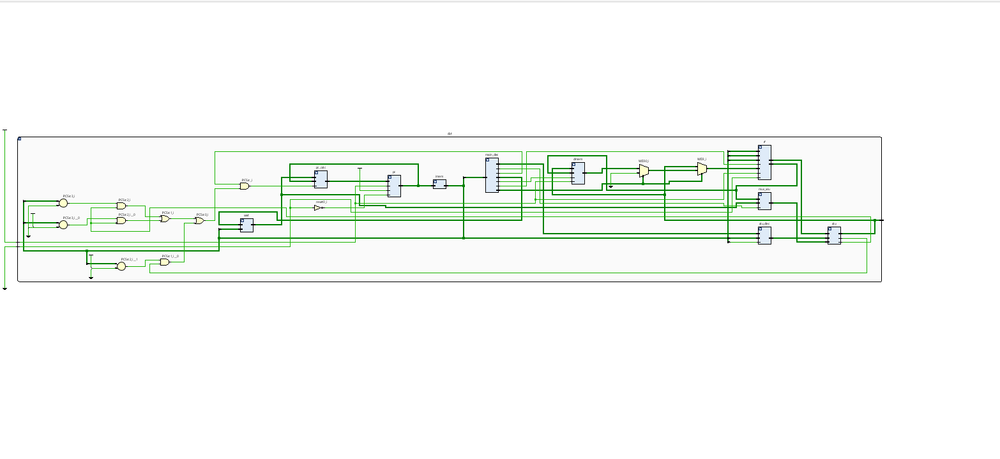
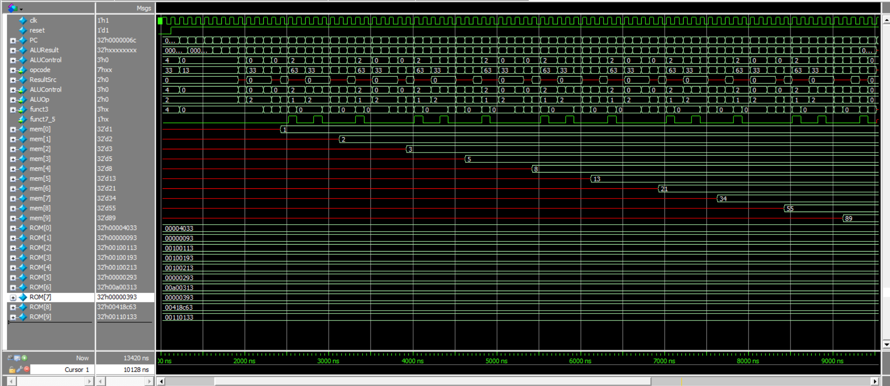

# RISC-V Single-Cycle Processor


## 📝 Project Overview
32-bit RISC-V processor implementing RV32I ISA, developed for IEEE Digital Electronics Design Workshop. Features:
- Single-cycle Harvard architecture
- 7-stage pipeline (fetch → writeback)
- FPGA verified on Cyclone® IV

## 📁 Repository Structure
```
riscv-single-cycle/
├── rtl/                   # Source files
│   ├── core/             # Main processor
│   │   ├── alu.v         # Arithmetic Logic Unit
│   │   ├── control_unit.v
│   │   └── riscv_top.v   # Top-level module
│   └── memory/           # Memory components
│       ├── instr_mem.v
│       └── data_mem.v
├── testbenches/          # Verification
│   ├── alu_tb.v
│   ├── processor_tb.v
│   └── test_programs/    # Assembly tests
├── docs/
│   ├── report.pdf        # IEEE workshop report
│   ├── block_diagram.png # Design schematic
│   └── timing_analysis/  # FPGA timing reports
├── results/              # Simulation outputs
│   ├── waveform.png      # GTKWave/VCD screenshot
│   └── log.txt           # Console output
└── README.md             # Project showcase
```

## 🛠️ Installation & Simulation
```bash
# Clone repository
git clone https://github.com/a7med57/riscv-single-cycle.git
cd riscv-single-cycle

# Run testbench (Icarus Verilog example)
iverilog -o sim testbenches/SingleCycleCPU_tb.v rtl/core/*.v
vvp sim
```

## 📊 Results
| Metric          | Value       |
|-----------------|-------------|
| Max Frequency   | 50 MHz      |
| CPI             | 1           |
| FPGA Resources  | 1200 LUTs   |



